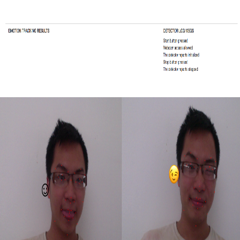
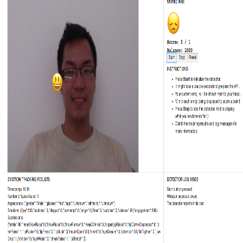

## Demo app using Ethereum / Truffle / IPFS 
This demo app has been upgraded  to a fully functional app. It's a game in which
user has to mimic an emoji to earn points. Each earned points is equivalent to 
some amount of token and the user balance is updated in the **Solidity contract** accordingly. 

IPFS is used to store the facial expressions that helps the user earn the points, and can be
viewed by clicking the "Stop" button. 

***This is the result of combining my previous project on Facial Recognition with what I recently learned with IPFS / Ethereum.***

### truffle-init-webpack
Example webpack project with Truffle. Includes contracts, migrations, tests, user interface and webpack build pipeline.

## Usage

`` npm install ``

Start testrpc: 

``testrpc``

Compile the contracts with ``truffle compile`` and migrate to the blockchain ``truffle migrate``

Start the app:

`` npm run dev ``

**Users are encouraged NOT to run with MetaMask, due to it constantly asking to validate a transaction.**

## Issues

Tests fully updated, every test cases pass. 

## Next step

Build a blockchain-based gambling app. Can't wait :)
